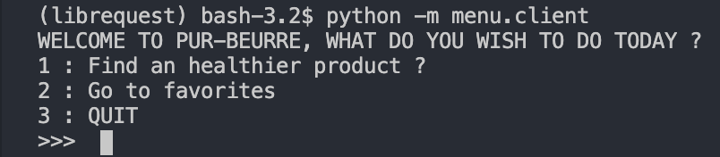
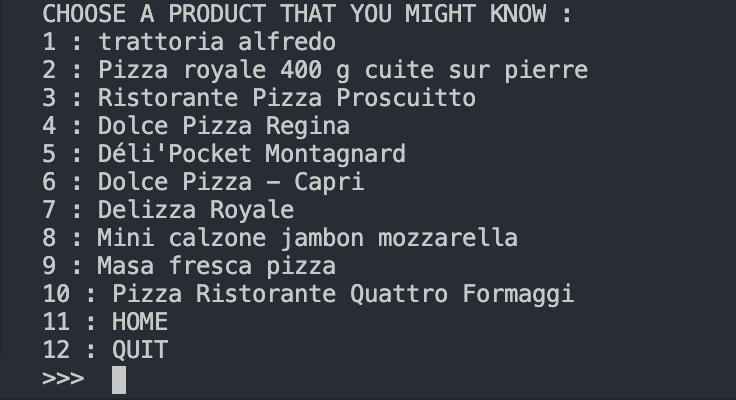
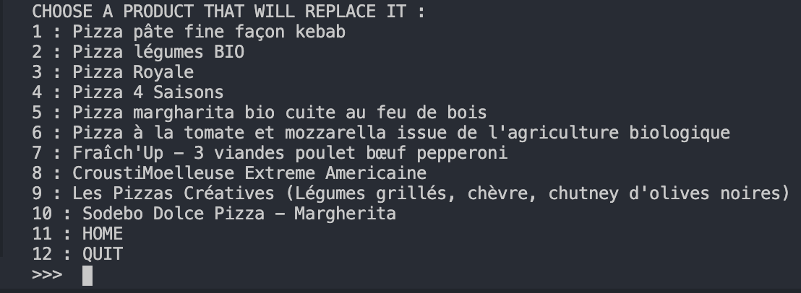
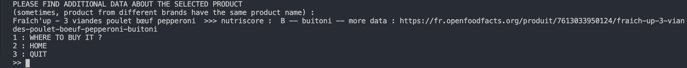
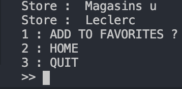
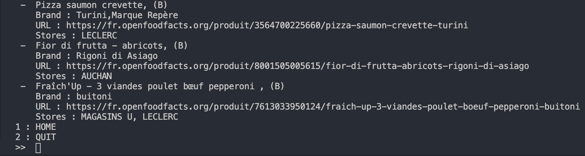

# OpenClassRooms project: 5
*This is the fifth project in part of the Python course at OC*
*Application that helps you choosing better food to eat*

## :snake: Python App Development - Project 5 - Purbeurre !

Here is the [link](https://github.com/jonathanreveille/Project5_OC.git) to the project

### What is in this project ?
- Use of OOP
- Use of pipenv (virtual environment with Python 3)
- Use of Peewee ORM [link](http://docs.peewee-orm.com/en/latest/)
- Respect and follow recommendations from PEP8(style guide),
 PEP257(docformatter)

### The project
For this project, we had to create an application that allows the user seek for food alternatives. 
Why seek for food alternatives?

Because it seems that product nutrition tables aren't easy to 
de-code in-store, this is why we have coded this application in order 
to ease your daily life when you are seeking for healthier food 
at your own neighborehood store. 
Also, the french market has noticed an increase of interest 
from consumers to aim for healthier products
and to put aside all products that are not healthy for humans.

Nutriscore is a good indicator to the food we ingest, versus, 
the lines of lies that we can find on packaging these
days (many different scandales from apparently healthy products
and brands). This is why, we focus on providing healthier products
to our users, according to **nutriscore**.

So far this application works under the **terminal mode**.
To ease its use, the virtual environment runs with pipenv.

This program will allow you to **save** your findings 
into **favorites** data if you are satisfied with the 
substitute product suggestions that you have selected.
It also regroups **product name**, its **nutriscore**, its **brand**
and the **store** where it is available.

### Getting started:

First of all, first you need to **install pipenv**

* `pipenv install` (install all requirements)
This will install all *requirements* that is required for 
this project (peewee, pymsql, requests and python 3.7)

The **advantage** of pipenv is that it is cross-platform. It is 
recommended by the official documentation for python's virtual
environment.

### BEFORE launching the app, place yourself into the folder of the project and run : 
 
* step1 : `pipenv run python -m models.downloader` (loads data to your db)
* step2 : `pipenv run python -m menu.client` (launches the app)

### More about the app architecture

**bdd folder** : Those scripts take care of : 
* dbconnexion.py : it connects our script to our db for SQL
* models.py : it creates all the different tables needed for this project
(use of ***peewee*** ORM).
* favoritemanager.py : it handles favorites of the user, creates favorites.
* product.manager.py : it handles product queries in order for the 
application to work (get product, get category, get stores). It gets 
data from the database, and shows it into the user interface.

**menu folder** : Those scripts take care of : 
* menu.py : it handles the menu behavior. Allows the developer 
to implement additional menu option ("home" or/and "quit").
It also allows our different menu to have a number to be selected
in order to take in account the choice of the user. Two classes 
were made : MenuHome (for home menu), and Menu (for all other 
step of the program)
* client.py : it's the user's interface. Each menu represent 
a different step of how the program works.

**models folder** : Those scripts take care of : 
* downloader.py : it connects to the OpenFoodFact API.
It also cleans the data gathered from the API (it checks 
if all keys we want are present, and if the keys we want have
avalue attached to it). Finally, it sends the data (list) into our 
database, by creating, new objects into our tables.

**settings folder**:
* config.py : it handles constants, in our case, the category
list. If you want to add more categories, just had a string object
into the existing list CATEGORY_LIST (e.g : "pains", or "bread")

**sql folder** :
* Entity Relationship diagram of the database
* SQL code to create database if you want. By the way, the script
models.downloader.py handles it already.

### Description of the project (application) :
The user will only need to use a number (integers) to select
the action he wishes the do with the application.

The program will ask the user to choose between two options : 
1- Find an healthier product? (SEEK FOR PRODUCT)
// 2- Got to Favorites

*If the user selects **1***:
- the program will now ask the user to select a category (input: a number) and then press 'enter'.
- the program will then ask the user to select a product from list of products.
- the program will then ask the user to select a product from the list of substitutes.
- the program will then ask the user if he wants to know the stores where he can find that product.
- the program will then suggest to add this search to his favorites.
- the program will finally ask the user if he wants to see his list of favorites of saved products.
- the user can go back home or quit the application at anytime.

*Else if the user selects **2***:
- the program will go directly to the user's favorites menu.
In order to see some favorites, the user needs to save at least
1 search. Else, the favorite menu will be empty, but still accessible
when launching the application the first time.

Here are a couple of screenshots of the application, enjoy : 

### Licence:
* Use of data from OpenFoodFacts [link](https://fr.openfoodfacts.org)

### Acknowledgement:
I would like to give special thanks to ***Thierry Chappuis***, my mentor,
for guiding me throughout this project.